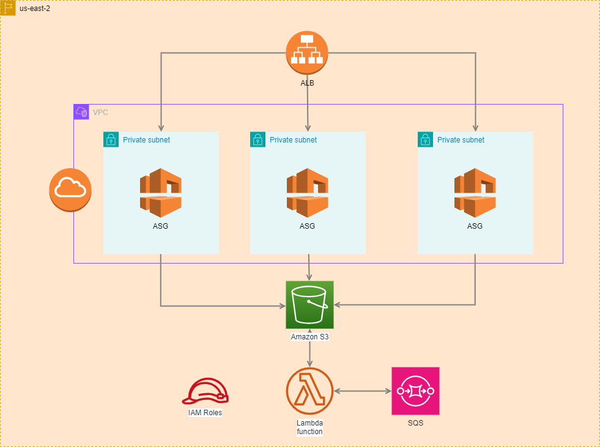

# Tada - Guide d'Utilisation - Infrastructure AWS



## Description Générale
Ce projet Terraform est conçu pour créer et gérer une infrastructure AWS complète comprenant un VPC, des groupes de sécurité, un équilibreur de charge (Load Balancer), un groupe d'AutoScaling, des rôles IAM pour EC2 et S3, un bucket S3, une file d'attente SQS et une fonction Lambda. Le projet utilise une série de modules Terraform pour modulariser et faciliter la gestion de l'infrastructure.

## Découvrez la Surprise à l'Adresse DNS de l'ALB
Un hommage à un classique des jeux vidéo vous attend lorsque vous accédez à l'adresse DNS de l'Application Load Balancer de notre infrastructure. Si vous aimez sauter dans des mondes remplis de briques et de tuyaux, vous serez ravi de découvrir ce qui se cache derrière ce lien. Un petit indice : notre héros moustachu adorerait ça !

## Structure des Dossiers
- `ressources`: Contient le fichier `main.tf` qui utilise différents modules pour construire l'infrastructure.
- `modules`: Sous-dossiers pour chaque module (VPC, ALB, EC2, S3, SQS, Lambda, etc.).
- `data.tf`: Fichier définissant les sources de données, telles que les AMIs AWS.
- `.gitlab-ci.yml`: Configuration CI/CD pour GitLab.
- `outputs.tf`: Fichier définissant les sorties du projet.
- `provider.tf`: Configuration du fournisseur AWS.
- `vars.tf`: Définition des variables utilisées dans le projet.
- `version.tf`: Spécification des versions Terraform et des providers requis.

## Modules et Leur Fonction
1. **VPC**: Crée un VPC avec des sous-réseaux publics et privés, un Internet Gateway, des tables de routage et des endpoints VPC.
2. **Security Groups**: Définit les groupes de sécurité pour EC2 et ALB.
3. **Load Balancer (ALB)**: Configure un équilibreur de charge application.
4. **AutoScaling Group**: Gère le scaling des instances EC2.
5. **IAM Roles**: Crée des rôles IAM pour l'accès SSM et S3 depuis EC2.
6. **S3**: Crée un bucket S3 et y télécharge le code Lambda.
7. **SQS**: Met en place une file d'attente SQS.
8. **Lambda**: Configure une fonction Lambda avec des déclencheurs SQS.

## Utilisation
1. **Initialisation**: Exécutez `terraform init` pour initialiser le projet et télécharger les modules et providers nécessaires.
2. **Planification**: Exécutez `terraform plan` pour prévisualiser les changements.
3. **Application**: Exécutez `terraform apply` pour déployer l'infrastructure.
4. **Destruction**: Utilisez `terraform destroy` pour supprimer l'infrastructure.

## CI/CD avec GitLab
Le fichier `.gitlab-ci.yml` contient des instructions pour créer le bucket S3 et la table DynamoDB pour le backend Terraform, ainsi que pour déployer l'infrastructure via CI/CD.

## Configuration
Les fichiers `vars.tf` et `version.tf` permettent de configurer les paramètres du projet, tels que la région AWS, les noms des ressources, les versions Terraform, etc.

## Outputs
Le fichier `outputs.tf` fournit des informations utiles sur l'infrastructure déployée, telles que les ID VPC, les DNS des load balancers, et plus.

## Voici une arborescence détaillée du projet
```txt
AWS/
└── Terraform/
    ├── .gitlab-ci.yml
    ├── modules/
    │   ├── alb_security_group/
    │   │   ├── main.tf
    │   │   └── variables.tf
    │   ├── autoscaling_group/
    │   │   ├── main.tf
    │   │   └── variables.tf
    │   ├── ec2_security_group/
    │   │   ├── main.tf
    │   │   └── variables.tf
    │   ├── ec2_ssm_iam/
    │   │   ├── main.tf
    │   │   └── variables.tf
    │   ├── lambda/
    │   │   ├── main.tf
    │   │   └── variables.tf
    │   ├── load_balancer/
    │   │   ├── main.tf
    │   │   └── variables.tf
    │   ├── s3/
    │   │   ├── main.tf
    │   │   └── variables.tf
    │   ├── sqs/
    │   │   ├── main.tf
    │   │   └── variables.tf
    │   └── vpc/
    │       ├── main.tf
    │       └── variables.tf
    ├── ressources/
    │   ├── main.tf
    │   ├── outputs.tf
    │   ├── provider.tf
    │   ├── vars.tf
    │   └──  version.tf
    └── data.tf
```

# Instructions pour Configurer le Backend Terraform

## Introduction
Pour gérer l'état de Terraform dans notre projets, il est recommandé d'utiliser un backend S3. Cette documentation nous guide à travers la création d'un bucket S3 et d'une table DynamoDB pour le verrouillage d'état, ainsi que la configuration des variables nécessaires dans GitLab CI/CD.

#### Étape 1: Créer un Bucket S3

1. **Ouvrir le Terminal AWS CLI :**
   Ouvrez votre terminal et assurez-vous que AWS CLI est installé et configuré avec vos identifiants AWS.

2. **Créer le Bucket S3 :**
   Exécutez la commande suivante pour créer un nouveau bucket S3. Remplacez `mon-bucket-terraform-galere` par le nom souhaité pour votre bucket.
   ```
   aws s3api create-bucket --bucket mon-bucket-terraform-galere --region us-east-1
   ```

3. **Activer le Versioning (option) :**
   Pour activer le versioning sur votre bucket, utilisez la commande suivante :
   ```
   aws s3api put-bucket-versioning --bucket mon-bucket-terraform-galere --versioning-configuration Status=Enabled
   ```

#### Étape 2: Créer une Table DynamoDB pour le Verrouillage d'État

1. **Créer la Table DynamoDB :**
   Exécutez la commande suivante pour créer une table DynamoDB. Remplacez `ma-table-lock-terraform-galere` par le nom souhaité pour votre table.
   ```
   aws dynamodb create-table --table-name ma-table-lock-terraform-galere --attribute-definitions AttributeName=LockID,AttributeType=S --key-schema AttributeName=LockID,KeyType=HASH --provisioned-throughput ReadCapacityUnits=1,WriteCapacityUnits=1 --region region
   ```

#### Étape 3: Configurer le Backend dans Terraform

1. **Modifier le fichier `backend.tf` :**
   Ouvrez le fichier `backend.tf` et ajustez les valeurs de configuration du backend S3 pour correspondre à votre configuration AWS :
   ```hcl
   terraform {
     backend "s3" {}
   }
   ```

#### Étape 4: Configurer les Variables dans GitLab

1. **Accéder à votre projet GitLab :**
   Connectez-vous à GitLab et accédez à votre projet.

2. **Configurer les Variables d'Environnement :**
   Dans GitLab, naviguez vers `Settings` > `CI/CD` et déroulez la section `Variables`. Ajoutez les variables suivantes :
   - `AWS_ACCESS_KEY_ID` : Votre clé d'accès AWS.
   - `AWS_SECRET_ACCESS_KEY` : Votre clé secrète AWS.
   - `AWS_DEFAULT_REGION`: La région AWS du projet
   - `TF_BACKEND_BUCKET` : Le nom de votre bucket S3.
   - `TF_BACKEND_KEY` : Le chemin de la clé dans le bucket S3.
   - `TF_BACKEND_REGION` : La région AWS du bucket.
   - `TF_BACKEND_DYNAMODB_TABLE` : Le nom de votre table DynamoDB.

Ces instructions vous permettront de configurer votre backend Terraform avec un bucket S3 et une table DynamoDB pour une gestion sécurisée et efficace de l'état de Terraform dans vos projets CI/CD GitLab.
